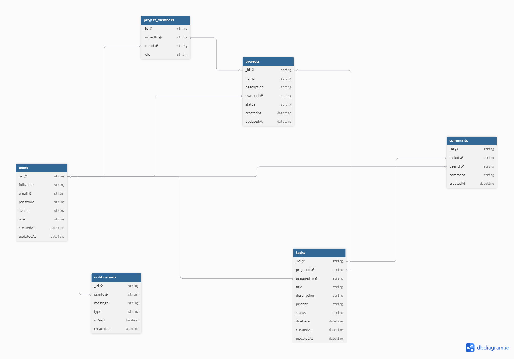

# TaskMatrix

## Enterprise Agile Project Management Platform

---

## Capstone Project

This repository contains the planning, architecture, UI/UX design, and implementation for **TaskMatrix**, a full-stack Agile Project Management platform inspired by tools such as Jira, Trello, and Asana.

TaskMatrix is designed to help software teams manage projects, organize work using Kanban boards, track task progress, and collaborate from a centralized workspace.

The project follows a **Modular Monolith Architecture** with separate frontend and backend applications organized inside a single repository.

---

# Designated Track

**Full Stack Developer**

---

# Current Project Status

## Sprint 15 — Feature Complete

The core task management pipeline is now functional.

### Completed

* User registration
* User login
* JWT authentication
* Protected routes
* Password hashing
* Task creation
* Task retrieval
* Task update
* Task deletion
* Task ownership validation
* Kanban board task organization
* Task status management
* Task priority management
* Dashboard task statistics
* Optimistic task deletion
* Frontend and backend deployment

Tasks are currently organized into the following workflow stages:

```text
To Do → In Progress → Completed
```

The application is deployed and the core CRUD lifecycle is fully functional.

---

# Live Deployment

## Frontend

Vercel:

https://prodesk-capstone-taskmatrix-neon.vercel.app

## Backend

Render:

https://prodesk-capstone-taskmatrix-nz73.onrender.com

## Database

MongoDB Atlas

---

# Figma Design

Public Design File:

https://www.figma.com/design/nyFHGR0PcI0m5JQcg7Wso0/TaskMatrix-Capstone?node-id=0-1&t=xUYBJvgORmsKPqfY-1

---

# Tech Stack

## Frontend

* React
* TypeScript
* Vite
* React Router
* Redux Toolkit
* TanStack Query
* Tailwind CSS
* React Hook Form
* Zod
* Axios
* React Hot Toast

---

## Backend

* Node.js
* Express.js
* TypeScript
* MongoDB
* Mongoose
* JWT Authentication
* Bcrypt
* Zod

---

## DevOps

* Git
* GitHub
* Vercel
* Render
* MongoDB Atlas

---

# Application Features

## Authentication

Implemented:

* User Registration
* User Login
* JWT Authentication
* Protected Routes
* Password Hashing
* Logout

Authentication flow:

```text
User
 ↓
Register / Login
 ↓
Backend Validation
 ↓
Password Hashing / Verification
 ↓
JWT Generation
 ↓
Frontend Token Storage
 ↓
Protected API Requests
```

---

# Task Management

TaskMatrix currently supports the complete task lifecycle.

## Create

Authenticated users can create tasks containing:

* Title
* Description
* Status
* Priority
* Due Date

## Read

Users can retrieve their own tasks from the backend API.

## Update

Users can update their own task information, including:

* Title
* Description
* Status
* Priority
* Due Date

## Delete

Users can delete their own tasks.

The frontend also implements optimistic deletion so that the task is removed from the interface immediately while the API request is processed.

---

# Kanban Board

Tasks are organized visually into workflow columns:

```text
┌────────────┐
│   TO DO    │
└────────────┘

┌────────────┐
│ IN PROGRESS│
└────────────┘

┌────────────┐
│ COMPLETED  │
└────────────┘
```

The Kanban board currently supports:

* Task grouping by status
* Task priority indicators
* Task deletion
* Task editing
* Task status updates

Future iterations will add drag-and-drop task movement.

---

# Dashboard

The dashboard provides an overview of the user's task workload.

Current statistics include:

* Total Tasks
* Pending Tasks
* In Progress Tasks
* Completed Tasks

The dashboard is designed as the central workspace for future project, team, notification, and activity features.

---

# Data Ownership and Security

Each task stores the ID of the authenticated user who created it.

Example:

```ts
{
  ownerId: authenticatedUserId
}
```

All task queries are scoped to the authenticated user.

For example:

```ts
Task.find({
  ownerId: authenticatedUserId
});
```

For individual operations:

```ts
Task.findOne({
  _id: taskId,
  ownerId: authenticatedUserId
});
```

This ensures that a user cannot:

* Read another user's tasks
* Update another user's tasks
* Delete another user's tasks

Authentication is enforced using JWT middleware.

---

# REST API

## Authentication

```text
POST /api/auth/register
POST /api/auth/login
```

---

## Tasks

All task endpoints require a valid JWT token.

```text
POST   /api/tasks
GET    /api/tasks
GET    /api/tasks/:id
PUT    /api/tasks/:id
DELETE /api/tasks/:id
```

Authorization header:

```text
Authorization: Bearer <JWT_TOKEN>
```

---

# System Architecture

```text
┌─────────────────────┐
│      React App      │
│      Vercel         │
└──────────┬──────────┘
           │
           │ Axios + JWT
           │
           ▼
┌─────────────────────┐
│    Express API      │
│      Render         │
└──────────┬──────────┘
           │
           ▼
┌─────────────────────┐
│ Authentication      │
│ Middleware          │
└──────────┬──────────┘
           │
           ▼
┌─────────────────────┐
│ Controllers         │
└──────────┬──────────┘
           │
           ▼
┌─────────────────────┐
│ Services            │
└──────────┬──────────┘
           │
           ▼
┌─────────────────────┐
│ MongoDB Atlas       │
└─────────────────────┘
```

---

# Repository Structure

```text
prodesk-capstone-taskmatrix/

├── frontend/
│
├── backend/
│
├── docs/
│   ├── figma/
│   └── architecture/
│
├── README.md
├── Prompts.md
└── .gitignore
```

---

# Frontend Architecture

```text
src/

├── api/
│   └── axios.ts
│
├── constants/
│
├── features/
│
│   ├── auth/
│   │   ├── api/
│   │   ├── components/
│   │   ├── hooks/
│   │   ├── pages/
│   │   ├── types/
│   │   └── validation/
│   │
│   ├── dashboard/
│   │   └── pages/
│   │
│   └── tasks/
│       ├── api/
│       ├── components/
│       └── hooks/
│
├── layouts/
│
├── routes/
│
├── store/
│   ├── hooks.ts
│   └── slices/
│
├── App.tsx
└── main.tsx
```

---

# Backend Architecture

```text
src/

├── config/
│
├── modules/
│
│   ├── auth/
│   │   ├── auth.controller.ts
│   │   ├── auth.routes.ts
│   │   ├── auth.schema.ts
│   │   └── auth.service.ts
│   │
│   └── tasks/
│       ├── task.controller.ts
│       ├── task.routes.ts
│       ├── task.model.ts
│       ├── task.schema.ts
│       └── task.service.ts
│
├── shared/
│   ├── middleware/
│   └── utils/
│
├── app.ts
└── server.ts
```

---

# Database Collections

## Currently Implemented

### Users

Stores:

* Name
* Email
* Hashed Password

### Tasks

Stores:

* Title
* Description
* Status
* Priority
* Due Date
* Owner ID
* Created At
* Updated At

---

# Planned Database Collections

The following collections are planned for future versions:

* Projects
* Comments
* Notifications
* Project Members
* Teams
* Activity Logs

---

# Planned Features

## Project Management

* Create Project
* Edit Project
* Delete Project
* Archive Project
* Search Projects
* Filter Projects

---

## Team Collaboration

* Create Teams
* Invite Members
* Member Roles
* Task Assignment
* Team Permissions
* Online Status

---

## Advanced Task Management

* Drag and Drop Kanban
* Task Assignment
* Labels
* Attachments
* Comments
* Subtasks
* Due Date Reminders

---

## Notifications

* Task Assigned
* Due Date Reminder
* Project Updates
* Real-time Notifications

---

## Real-Time Features

* Live Chat
* Online Users
* Real-time Task Updates
* Real-time Notifications

---

## Profile

* Update Profile
* Change Password
* Upload Avatar

---

## Settings

* Workspace Settings
* Notification Preferences
* Security Settings

---

# Planned UI Screens

* Login
* Register
* Dashboard
* Projects
* Kanban Board
* Task Details
* Notifications
* Team Members
* Profile
* Calendar
* Settings

---

# UI Wireframes

Figma designs and UI wireframes are available inside:

```text
docs/figma
```

---

# ERD

The planned database architecture is represented by the following ERD:



The architecture is designed to support relationships between:

* Users
* Projects
* Tasks
* Comments
* Project Members
* Notifications

---

# Future Improvements

Future iterations of TaskMatrix may include:

* Team and Workspace Management
* Role-Based Authorization
* Redis Caching
* Docker
* CI/CD
* AI Task Suggestions
* Calendar Integration
* Email Notifications
* Analytics Dashboard
* Activity Logs
* Dark Mode
* Drag-and-Drop Kanban
* Stripe-based Premium Workspace Features

---

# Deployment

## Frontend

Deployed using:

**Vercel**

## Backend

Deployed using:

**Render**

## Database

Hosted using:

**MongoDB Atlas**

The frontend and backend are configured for production deployment and environment-specific configuration.

---

# Development

## Frontend

```bash
cd frontend
npm install
npm run dev
```

## Backend

```bash
cd backend
npm install
npm run dev
```

---

# Environment Variables

## Frontend

```env
VITE_API_URL=http://localhost:5000/api
```

## Backend

```env
PORT=5000
MONGO_URI=your_mongodb_connection_string
JWT_SECRET=your_jwt_secret
CLIENT_URL=http://localhost:5173
```

Production secrets should never be committed to GitHub.

---

# Sprint 15 Deliverable

Sprint 15 focused on making the core task management workflow fully functional.

The completed implementation includes:

* JWT-protected REST API
* Secure task CRUD operations
* Task ownership validation
* React frontend API integration
* TanStack Query server-state management
* Task creation
* Task retrieval
* Task updates
* Task deletion
* Kanban board workflow
* Task statistics
* Optimistic deletion
* Production deployment

The core pipeline is now:

```text
Register
   ↓
Login
   ↓
JWT Authentication
   ↓
Protected Dashboard
   ↓
Create Task
   ↓
View Task
   ↓
Edit Task
   ↓
Move Through Workflow
   ↓
Delete Task
```

---

# Author

**Sriniketh Vangipuram**

---

## License

This project was created for educational and internship purposes as part of the Prodesk IT Solutions Capstone Project.
